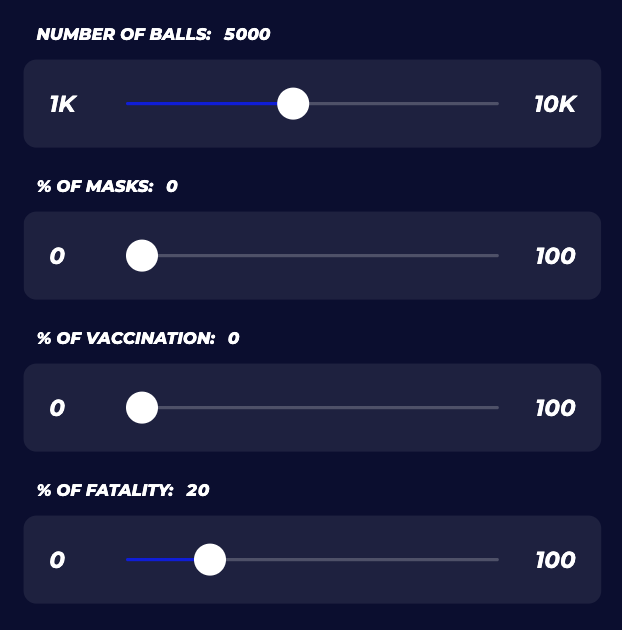
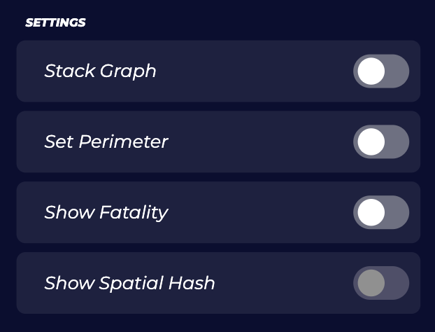

# Covid19 Vaccination Simulation

## Introduction
This is a web simulation for testing and analyzing the spread of the COVID-19 pandemic. It features an animated visualization as well as graphs and statistics. Due to the randomness of the simulation every user will experience different outcomes. Users can also manipulate the parameters and observe how it effects the spread. 

Try the simulation [_here_](https://telos-j.github.io/covid19-simulation/).

## How to use
Sliders

The sliders can be used to change the parameters of the simulation. The slider parameters are described below.

Number of balls

The number of balls represent the total number of agents present in the beginning of the simulation. 

Percentage of masks

Agents that are wearing masks are represented as balls with a thick white border. These agents are less susceptable to be infected than normal agents.

Percentage of vaccination

Agents that are vaccinated are represented as balls with a thick yellow border. These agents are less susceptable to be infected than normal agents.

Percentage of fatality

Users can also adjust how fatal the virus is. Agents that have died from the virus are represented as black balls and become immobile. 

Toggles

In addition to the sliders there are toggle buttons that the user may use to change some settings of the simulation.

Stack Graph

The graphs for each simulation will be stacked onto each other. Users may want to toggle this on to compare the results between each simulation.

Set Perimeter

This only takes effect when there are vaccinated agents present in the simulation. The vaccinated agents will be distributed to from a perimeter around the source of outbreak. Doing so, we can observe how strategically vaccinating certain regions first may affect the spread of the virus.

Show Fatality

Only the black balls will be rendered onto the screen. This can be used to get a clear vision of the fatality of the simulation.

Show Spatial Hash

An important data structure that is being used to scale the simulation effectively is spatial hashing. A grid is shown across the screen that will highlight each cell when the user hovers over it. The highlighted cell shows which agents it contains and therefore controls the number of operations it runs. 

## Masks
Agents wearing masks are less susceptable to be infected than normal agents. The probability of infection of a masked agent is calculated with the effect the mask has on filtering aerosols. For instance, an agent wearing a N95 mask will leak 70% less aerosols into the environment and also have 99% less aerosols leaked into the mouth and nasal parts.

## Vaccination
Vaccinated agents are less susceptable to be infected than normal agents. The probability of infection of a vaccinated agent is calculated with the efficacy of the vaccine. For instance, the Pfizer vaccine has a 95% efficacy against COVID-19.

